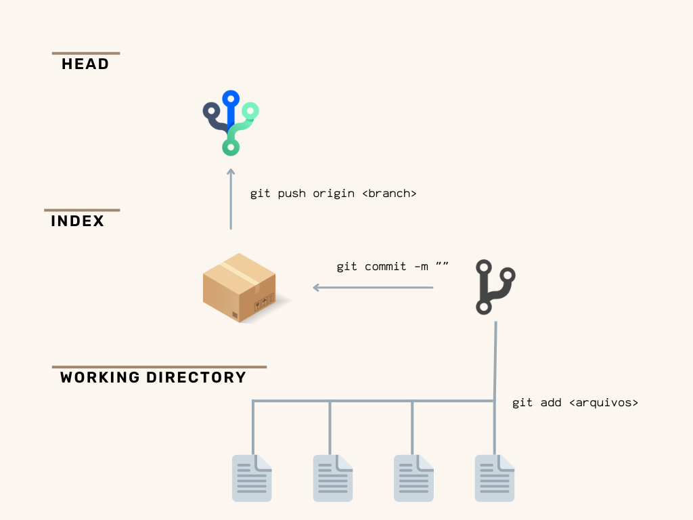

# Tutorial para o uso do git

### Git init

Inicia um novo projeto git
```
git init
```

### Git Clone

Esse comando funciona para baixar o projeto a partir de um link de um repositorio
```
git clone /caminho
```

## Fluxo de trabalho
 
O git possui um sistema de arvore definido por aréas aonde os arquivos vão ser mantido até serem submetidos para a proxima etapa, esse fluxo segue o segunte caminho por 3 areas:

* Working Directory - É o seu local de trabalho, são todos os arquivos que foram editados, excluidos ou adicionados antes de um commit e antes de serem enviados para o servidor
* Index - Área temporaria onde os arquivos são empacotados antes de serem submetidos
* HEAD - Local onde fica os arquivos originais de cada ramificação

### Submeter alterações

Antes de enviar um conjunto de arquivos ou um arquivo unico para o repositorio precisamos adicionar eles ao index, para adicionar para a nossa arvore "temporaria" usamos o seguinte comando:
```
git add <arquivo>
```
Podemos também adicionar um conjunto de arquivos com o comando:
```
git add *
```
Onde adicionamos todos os arquivos do diretorio relacionado, lembrando que os arquivos estão na maquina atual ainda e não no servidor.

O proximo passo é juntar todos esses arquivos em um "pacote" para submeter tudo para a arvore principal:

````
git commit -m "o seu comentario da alteração vai aqui"
````

O comando commit junta todos os arquivos que estão no index e deixa pronto para submeter para a HEAD

Por fim para submeter todos os commits para a ramificação principal (HEAD) usamos o comando:
````
git push origin sua_branch
````

## Ramificações

Quando trabalhamos com o git podemos além da ramificação principal, criar novas ramificações em cima de uma nova ou trocar de ramificações quando quiser, a vantagem disso é poder trabalhar em diferentes ambientes sem alterar o codigo principal ou ambientes paralelos.

Para manipular ramificações usamos o comando ````checkout````, antes de criar uma ramificação precisamos entrar na ramificação que vai dar origem a nova, para isso usamos o seguinte comando:

````
git checkout sua_branch
````
Dica: para verificar o status de qual branch você está e dados sobre a arvore local e commits, você pode usar o comando ```` git status ````

Após entrar em uma branch você pode criar a nova ramificação usando o comando:
````
git checkout -b nova_branch
````

E para remover a branch:
````
git branch -d nova_branch
````
 E por fim para enviar uma branch para o servidor use o comando `````push````
 ````
 git push origin nova_branch
````
## Atualizar e Merge
Agora que sabemos que a nossa arvore pode ter mais de uma ramificação, podemos unir a outras ramificações o nosso ambiente ou atualizar com os codigos novos presentes no servidor

Para atualizar sua ramificação com a mesma ramificação mas do servidor use o comando:
````
git pull
````
Esse comando é importante antes de submeter o codigo para o index pois certifica que o seu codigo vai estar atualizado com o servidor e atualizar somente as suas implementações.

Para realizar a junção de duas branch temos o comando:
````
git merge sua_branch
````
 Lembrando que nos 2 comandos o git vai tentar mesclar os 2 conjuntos de arquivo mas nem sempre isso é possivel, obrigando o usuario a resolver os conflitos antes de submeter as alterações.
 Após resolver os conflitos se houver, podemos realizar a mesma sequencia que usamos para submeter uma alteração normal.
 
 
 
